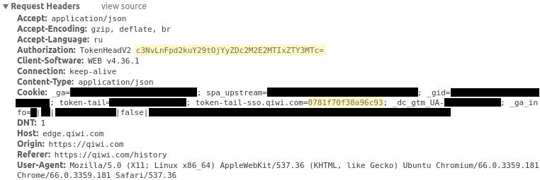

# Usage Examples



```bash
./qiwi-payment-history.sh --person="11231231212" --authorization="c3NvLnFpd2kuY29tOjYyZDc2M2E2MTIxZTY3MTc=" --cookie="0781f70f30a96c93"
./qiwi-payment-history.sh -p="11231231212" -a="c3NvLnFpd2kuY29tOjYyZDc2M2E2MTIxZTY3MTc=" -c="0781f70f30a96c93"
```

